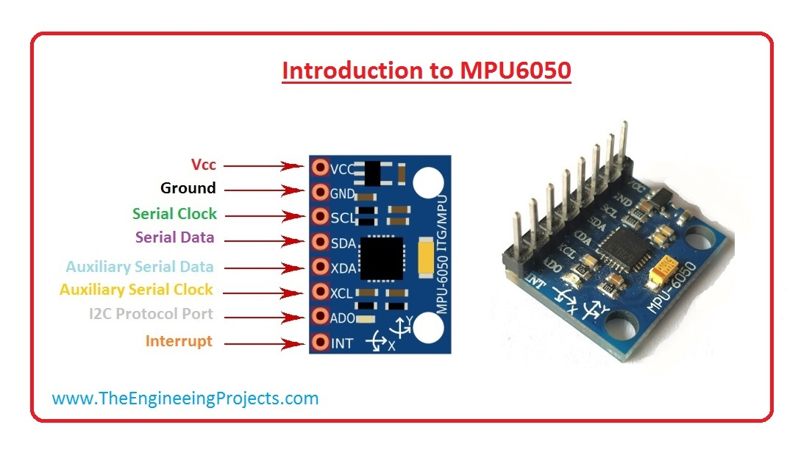

# MPU6050_driver
Driver implemented in C for MPU6050 using ST's STM32F401RE Nucleo board.

MPU6050 is an 3-axis (x,y,z) accelerometer and gyroscope, which also includes a temperature sensor.
The I2C bus is used to communicate with it.

  

The pin configuration is as follows:
- VCC - Supply
- GND - Ground
- SCL - I2C Clock
- SDA - I2C Data
- XCL - I2C Slave clock (in case another sensor is connected with the MPU6050)
- XDA - I2C Slave Data (in case another sensor is connected with the MPU6050)
- AD0 - Address select
- INT - Interrupt

Folders:
- **/Driver_code** folder for the driver implementation source code and more details.
- **/MPU6050_example** folder there is an example that can be ported directly to STM32IDE.
- **/Doc** has the main manuals used for the MPU6050 and images for the Readme.

For now the current operations are supported:
- Read/Write operations on the I2C bus (generalised)
- Reading values from the accelerometer/gyroscope/temperature sensors
- Configuring sampling rate and accuracy
- Setting different power modes (low_power, sleep, power)
- Interrupt generation and handling
- Self Test Routine (calibration method)
- Pitch/Roll angle calculation

Part of the driver is based on the implementation of these 2 repos:
 - https://github.com/sinadarvi/SD_HAL_MPU6050
 - https://github.com/leech001/MPU6050
